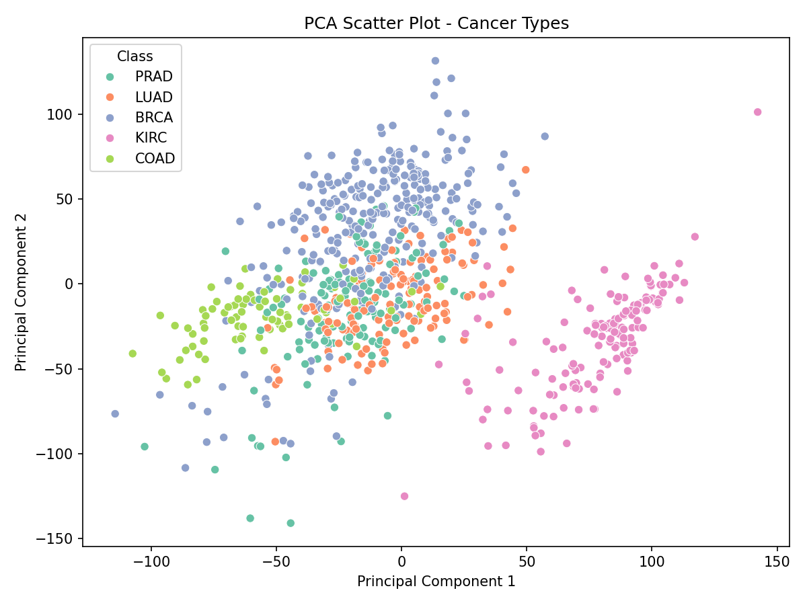
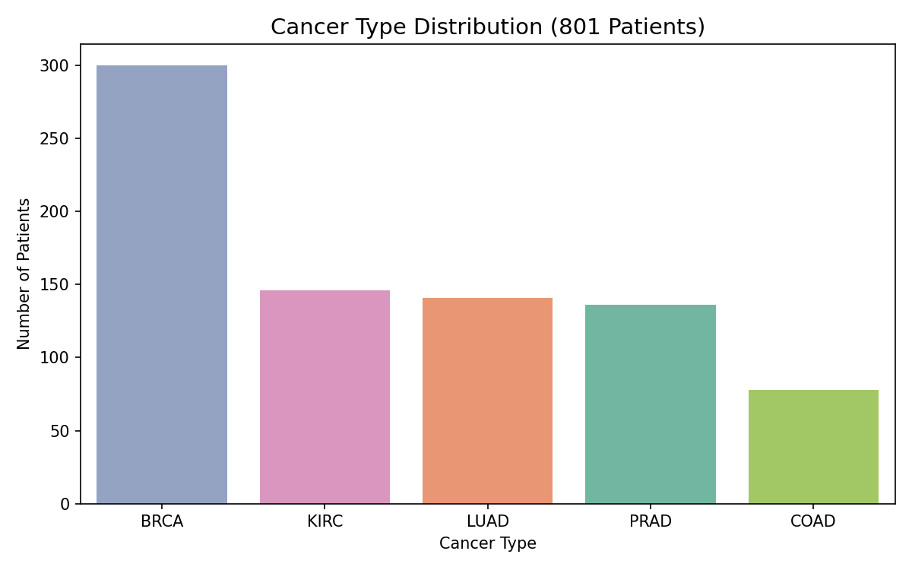
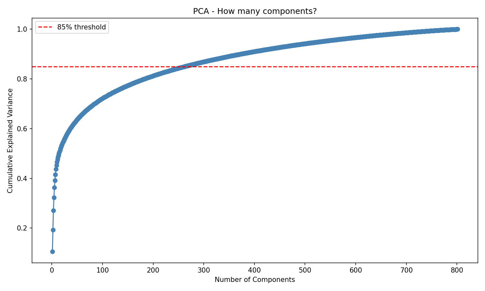
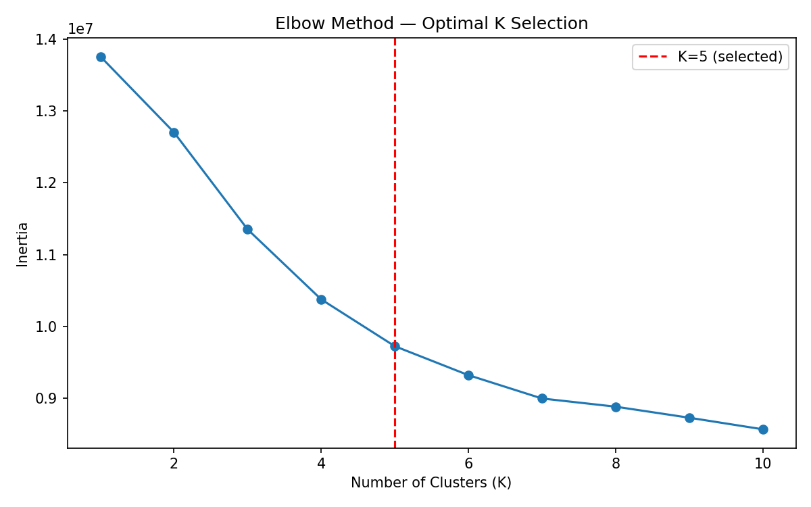
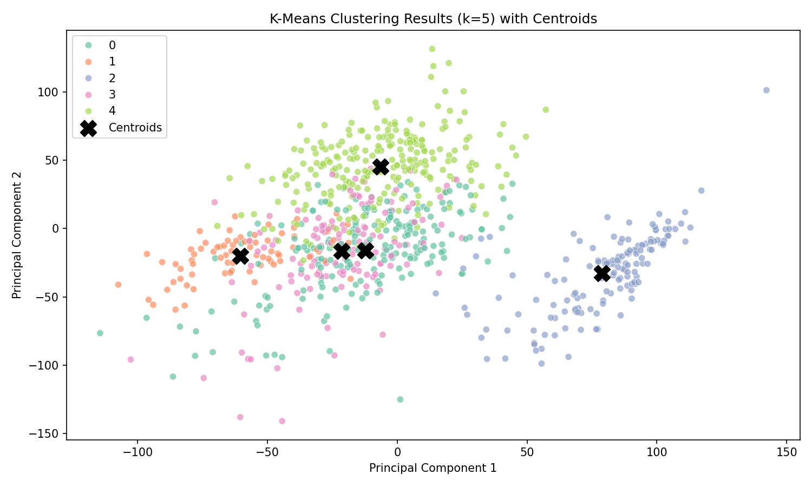
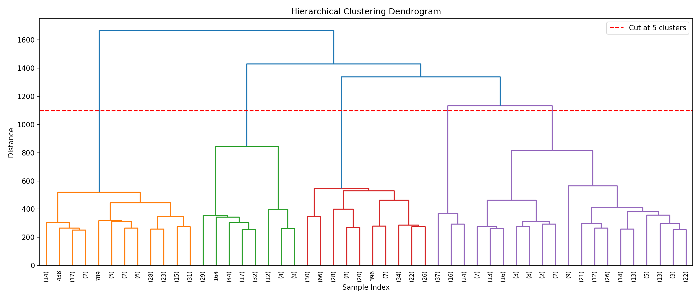

# Cancer Subtype Discovery



Unsupervised Machine Learning project to discover cancer subtypes
from gene expression data using K-Means Clustering on TCGA Pan-Cancer RNA-Seq dataset.

[](https://cancer-subtype-discovery-5z5ftcx4mxvri6raw9mcox.streamlit.app/)
[](https://cancer-subtype-discovery.onrender.com/)
[](https://github.com/mushahidhussainleel/cancer-subtype-discovery)

---

## Overview

This project applies unsupervised machine learning to identify natural cancer
subtype groupings from high-dimensional RNA-Seq gene expression data —
without using any labels during training.

The pipeline covers the complete ML workflow:
**EDA → Preprocessing → Dimensionality Reduction (PCA) → Clustering → Evaluation → FastAPI Backend → Streamlit Frontend → Deployment**

---

## Live Links

| Service | URL |
|---------|-----|
| Streamlit Frontend | https://cancer-subtype-discovery-5z5ftcx4mxvri6raw9mcox.streamlit.app/ |
| FastAPI Backend | https://cancer-subtype-discovery.onrender.com/ |
| API Docs (Swagger) | https://cancer-subtype-discovery.onrender.com/docs |

---

## Dataset

**TCGA Pan-Cancer RNA-Seq** — UCI ML Repository

| Property | Value |
|----------|-------|
| Source | [UCI ML Repository](https://archive.ics.uci.edu/dataset/401/gene+expression+cancer+rna+seq) |
| Patients | 801 |
| Gene Features | 20,531 |
| Cancer Types | 5 |
| Labels | BRCA, KIRC, COAD, LUAD, PRAD |

> Note: Labels were used only for evaluation and visualization — not for training.

---

## Cancer Subtypes

| Code | Full Name |
|------|-----------|
| BRCA | Breast Invasive Carcinoma |
| KIRC | Kidney Renal Clear Cell Carcinoma |
| COAD | Colon Adenocarcinoma |
| LUAD | Lung Adenocarcinoma |
| PRAD | Prostate Adenocarcinoma |

---

## ML Pipeline

```
Raw Data (801 x 20531)
        ↓
Exploratory Data Analysis
        ↓
StandardScaler (Feature Scaling)
        ↓
PCA — 20531 → 262 components (85% variance retained)
        ↓
K-Means Clustering (k=5)
        ↓
Evaluation (Silhouette + Davies-Bouldin)
        ↓
FastAPI Backend → Streamlit Frontend → Deployment
```

---

## Notebooks

| Notebook | Description |
|----------|-------------|
| [01_EDA.ipynb](backend/notebooks/01_EDA.ipynb) | Data loading, cleaning, distribution analysis, skewness |
| [02_Dimensionality_Reduction(PCA).ipynb](backend/notebooks/02_Dimensionality_Reduction(PCA).ipynb) | StandardScaler, PCA, explained variance, 2D visualization |
| [03_Clustering_and_Model_Selection.ipynb](backend/notebooks/03_Clustering_and_Model_Selection.ipynb) | K-Means, Hierarchical, DBSCAN, evaluation, model selection |

---

## Visualizations

### Cancer Type Distribution


### PCA Explained Variance


### PCA Scatter Plot — Cancer Types


### Elbow Method — Optimal K


### K-Means Clustering Results with Centroids


### Hierarchical Clustering Dendrogram


---

## Model Selection

Three algorithms were evaluated:

| Algorithm | Silhouette Score | Davies-Bouldin | Clusters | predict() | Selected |
|-----------|-----------------|----------------|----------|-----------|----------|
| K-Means | 0.167 | 2.369 | 5 | Yes | **Yes** |
| Hierarchical | 0.168 | 2.362 | 5 | No | No |
| DBSCAN | N/A | N/A | 3 | No | No |

**K-Means selected** as final model due to `predict()` capability required for FastAPI deployment.

> Moderate scores are expected for 262-dimensional gene expression data.
> DBSCAN failed — no clear density structure in high-dimensional space.

---

## Cluster Profiling

| Cluster | Dominant Cancer Type | Count |
|---------|---------------------|-------|
| 0 | PRAD | 134 |
| 1 | COAD | 74 |
| 2 | KIRC | 145 |
| 3 | LUAD | 141 |
| 4 | BRCA | 232 |

---

## API Endpoints

| Method | Endpoint | Description |
|--------|----------|-------------|
| GET | `/` | Landing page |
| GET | `/model-info` | Model details and cluster mapping |
| POST | `/predict` | Upload CSV → cancer subtype prediction |

### Sample Request

```bash
curl -X POST "https://cancer-subtype-discovery.onrender.com/predict" \
  -F "file=@sample_patient.csv"
```

### Sample Response

```json
{
  "cluster_id": 2,
  "cancer_type": "KIRC",
  "full_name": "Kidney Renal Clear Cell Carcinoma",
  "description": "Kidney cancer subtype detected based on gene expression pattern.",
  "disclaimer": "This tool is for research purposes only..."
}
```

---

## Project Structure

```
cancer-subtype-discovery/
├── backend/
│   ├── api/
│   │   ├── main.py           # FastAPI app — 3 endpoints
│   │   ├── predict.py        # ML pipeline — scale → PCA → predict
│   │   ├── schemas.py        # Pydantic schemas + cluster mapping
│   │   └── home.html         # Landing page
│   ├── data/
│   │   └── raw/              # TCGA dataset (not tracked in git)
│   ├── model/
│   │   ├── kmeans_model.pkl  # Trained K-Means model
│   │   ├── pca_model.pkl     # Fitted PCA (262 components)
│   │   └── scaler.pkl        # Fitted StandardScaler
│   ├── notebooks/
│   │   ├── 01_EDA.ipynb
│   │   ├── 02_Dimensionality_Reduction(PCA).ipynb
│   │   └── 03_Clustering_and_Model_Selection.ipynb
│   ├── images/               # All visualization plots
│   └── requirements.txt
├── frontend/
│   ├── app.py                # Streamlit UI
│   ├── requirements.txt
│   └── assets/
│       ├── banner.png
│       └── sample_patient.csv
├── .gitignore
└── README.md
```

---

## Tech Stack

| Layer | Technology |
|-------|-----------|
| Language | Python 3.11 |
| ML | scikit-learn, scipy |
| Data | pandas, numpy |
| Visualization | matplotlib, seaborn |
| Backend | FastAPI, uvicorn |
| Frontend | Streamlit |
| Deployment | Render (API), Streamlit Cloud (UI) |

---

## How to Run Locally

### Backend

```bash
cd backend/api
pip install -r ../requirements.txt
uvicorn main:app --reload
```

### Frontend

```bash
cd frontend
pip install -r requirements.txt
streamlit run app.py
```

---

## Medical Disclaimer

> This project is intended for **research and educational purposes only**.
> It is **not a substitute** for professional medical diagnosis or advice.
> Always consult a qualified healthcare provider for medical decisions.
> Predictions are based on unsupervised machine learning and may not reflect clinical ground truth.

---

## Author

**Mushahid Hussain**
- GitHub: [@mushahidhussainleel](https://github.com/mushahidhussainleel)
- LinkedIn: [mushahid-hussain-dev](https://linkedin.com/in/mushahid-hussain-dev)